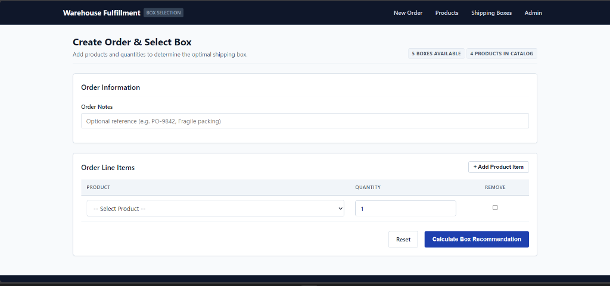
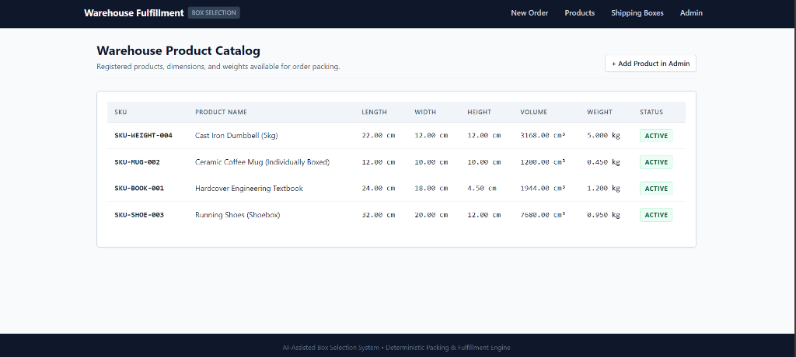
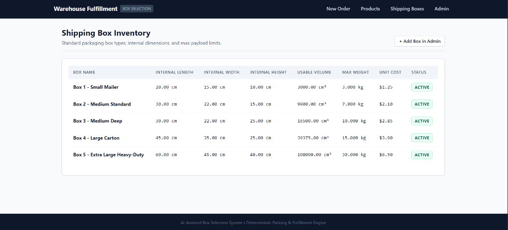
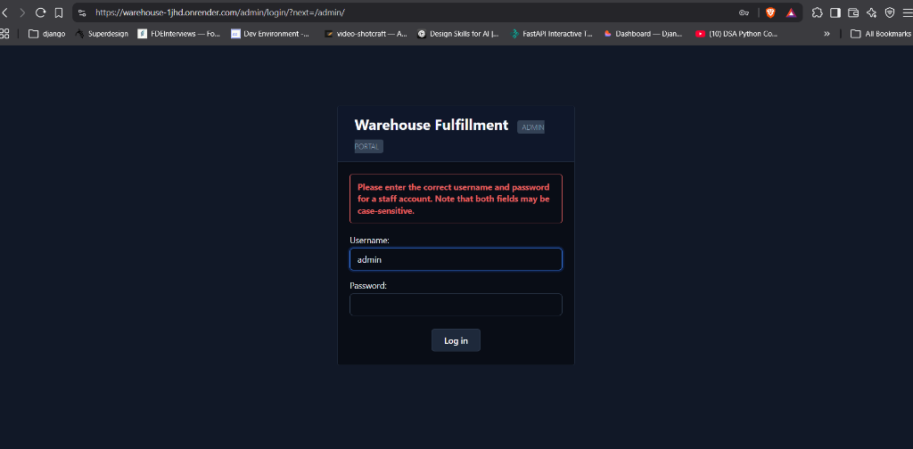
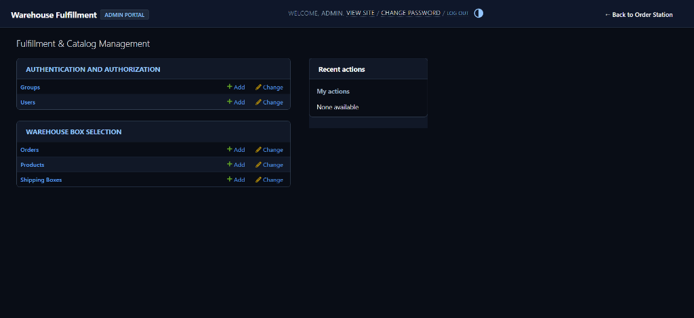
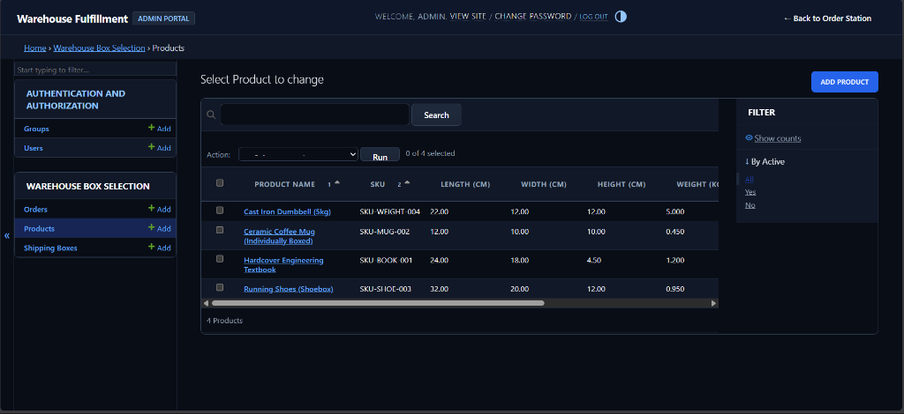

# 📖 Warehouse Fulfillment Application User Guide & Walkthrough

Welcome to the **AI-Assisted Box Selection & Warehouse Fulfillment System** visual user manual. This guide explains how to use every feature of the application, illustrated with real screenshots captured from live operational sessions.

---

## 🌐 Live & Local Access

| Portal | Local URL | Live Cloud URL (Render) | Credentials |
|---|---|---|---|
| **Order Station** | `http://127.0.0.1:8000/` | `https://warehouse-1jhd.onrender.com/` | Open Access |
| **Product Catalog** | `http://127.0.0.1:8000/products/` | `https://warehouse-1jhd.onrender.com/products/` | Open Access |
| **Shipping Box Inventory** | `http://127.0.0.1:8000/boxes/` | `https://warehouse-1jhd.onrender.com/boxes/` | Open Access |
| **Django Admin Portal** | `http://127.0.0.1:8000/admin/` | `https://warehouse-1jhd.onrender.com/admin/` | `admin` / `admin123` |

---

## 🛒 1. Interactive Order Station (Placing an Order)

Navigate to `/` to open the **Order Creation Station**. Operators select products, configure quantities, and enter optional fulfillment notes:

### How to Create an Order:
1. Select a product from the dropdown (e.g. `Hardcover Engineering Textbook` or `Ceramic Coffee Mug`).
2. Enter the required quantity (e.g., `2`).
3. Click **"+ Add Product Item"** to append additional SKUs to the order.
4. *(Optional)* Provide packing instructions in the **Order Notes** field.
5. Click **"Calculate Box Recommendation"** to trigger the deterministic packing algorithm.

---

## 📦 2. Packing Recommendation Result & Winner Card

The deterministic engine computes orthogonal rotations, 1D bounding stacks, and payload weight limits in **< 0.02s**:

### Key Result Components:
- **Winning Box Card**: Highlights the optimal box (`Box 2 - Medium Standard`), usable volume (`12,000.00 cm³`), unit cost (`$1.20`), and internal dimensions.
- **Physical Justification**: Human-readable explanation of why this box was selected.
- **Candidate Evaluation Table**: Itemizes all available boxes in inventory and details why smaller boxes were disqualified (e.g., `WEIGHT` or `DIMENSIONS` constraint violations).

---

## 🤖 3. Asynchronous AI Logistics Assistant

While the authoritative box recommendation renders instantaneously, the advisory AI layer synthesizes operator packaging and handling tips in the background:

### 4-Stage Stepped Synthesis:
1. **Analyzing request** (Deterministic packing calculated ✓)
2. **Generating content** (AI synthesizing warehouse packaging & handling tips ⏳)
3. **Reviewing quality** (Verifying physical consistency with deterministic constraints ✓)
4. **Finalizing document** (Rendering live advisory card with token usage count and model stats)

---

## 📋 4. Warehouse Product Catalog

Navigate to `/products/` in the top navigation bar to view the registered SKU catalog:

- Inspect exact Length, Width, Height ($cm$), Unit Weight ($kg$), and Calculated Volume ($cm³$).
- View active/inactive inventory status for each SKU.
- Quick link to add new products in Admin.

---

## 📦 5. Shipping Box Inventory

Navigate to `/boxes/` in the top navigation bar to inspect packaging types available in the packing station:

- Inspect internal usable dimensions ($cm$).
- Verify maximum payload weight limits ($kg$).
- Review unit pricing and usable volume for cost comparison.

---

## ⚙️ 6. Django Admin Portal & Management

### Admin Login Screen
Navigate to `/admin/` and authenticate using `admin` / `admin123`:

---

### Admin Dashboard (`/admin/`)
Access central configuration for Authentication, Orders, Products, and Shipping Boxes:

---

### Managing Products & Packaging in Admin (`/admin/warehouse/product/`)
Warehouse managers can add new SKUs, adjust physical dimensions, update weights, or configure custom box sizes:

- **Search & Filter**: Search by SKU or product name; filter by active status.
- **Add Product**: Click **"Add Product"** in the top right to register a new SKU.
- **Direct Return**: Click **"← Back to Order Station"** in the top right to return to the live order builder anytime.

---

*For technical architecture, algorithm flowcharts, and test verification logs, see [README.md](README.md) and [TEST_OUTPUT.md](TEST_OUTPUT.md).*
