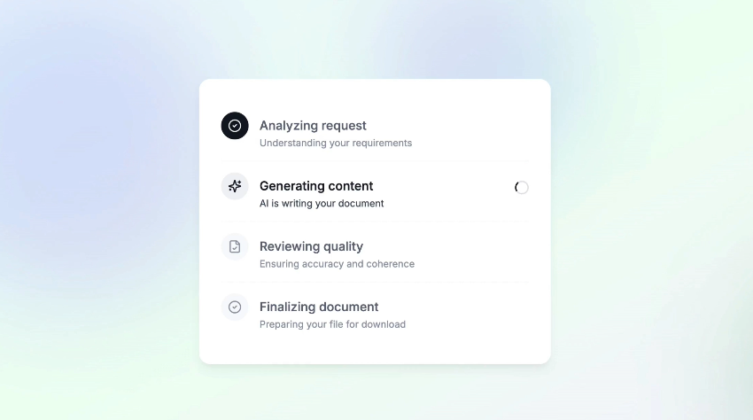
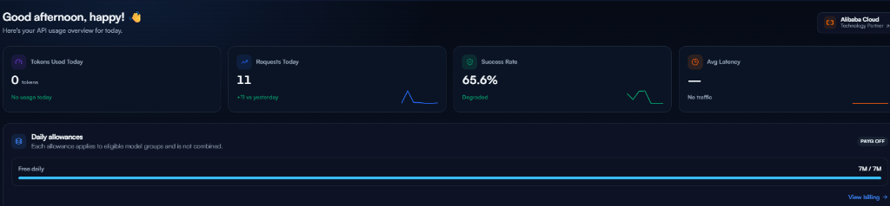

# 📖 Warehouse Fulfillment Application User Guide & Walkthrough

Welcome to the **AI-Assisted Box Selection & Warehouse Fulfillment System** user manual. This guide explains how to use every feature of the application, including creating customer orders, understanding packing recommendations, inspecting box rejection diagnostics, managing inventory catalogs, and administering products and packaging types in the Django Admin portal.

---

## 🌐 Live & Local Access

| Portal | Local URL | Live Cloud URL (Render) | Credentials |
|---|---|---|---|
| **Order Station** | `http://127.0.0.1:8000/` | `https://warehouse-1jhd.onrender.com/` | Open Access |
| **Product Catalog** | `http://127.0.0.1:8000/products/` | `https://warehouse-1jhd.onrender.com/products/` | Open Access |
| **Shipping Box Inventory** | `http://127.0.0.1:8000/boxes/` | `https://warehouse-1jhd.onrender.com/boxes/` | Open Access |
| **Django Admin Portal** | `http://127.0.0.1:8000/admin/` | `https://warehouse-1jhd.onrender.com/admin/` | `admin` / `admin123` |

---

## 🚀 Step 1: Placing a Warehouse Customer Order

1. Navigate to the **Order Station** (`/`).
2. You will see the **Interactive Order Builder**:
   - Select a product from the dropdown (e.g., `Hardcover Engineering Textbook (24.0×17.0×4.5 cm, 1.200 kg)`).
   - Enter the desired quantity (e.g. `2`).
3. To add more items to the order:
   - Click the **"+ Add Product Item"** button.
   - Select the next product (e.g., `Ceramic Coffee Mug (Individually Boxed)` with quantity `1`).
4. *(Optional)* Add fulfillment notes in the **Order Notes** field (e.g., `Priority rush order - fragile items`).
5. Click **"Calculate Box Recommendation"**.

---

## 📦 Step 2: Interpreting the Packing Recommendation Result

Once submitted, the deterministic recommendation engine evaluates the order across all available shipping boxes in **< 0.02s** and presents the result:

### What the Winner Card Shows:
- **Winning Box Name**: e.g., `Box 2 - Medium Standard`.
- **Status Badge**: `RECOMMENDED` (Green).
- **Usable Volume**: e.g. `12,000.00 cm³`.
- **Unit Cost**: e.g. `$1.20`.
- **Internal Dimensions**: `30.0 × 20.0 × 20.0 cm`.
- **Payload Capacity**: `5.000 kg` (Order Weight: `2.850 kg` $\rightarrow$ **Safe**).
- **Physical Justification**: Why this box won (Smallest suitable volume capable of safely fitting the items).

---

## 🔍 Step 3: Inspecting Candidate Box Rejections & Diagnostics

Beneath the winner card is the **Candidate Boxes Evaluation Table**, showing every box in the warehouse inventory and why it was accepted or rejected:

| Box Name | Internal Dimensions | Max Weight | Usable Volume | Cost | Result | Diagnostic Reason |
|---|---|---|---|---|---|---|
| **Box 1 - Small Mailer** | 20.0 × 15.0 × 10.0 cm | 2.000 kg | 3,000 cm³ | $0.50 | `DISQUALIFIED` | **`WEIGHT`**: Order (2.850 kg) exceeds box payload capacity (2.000 kg). |
| **Box 2 - Medium Standard** | 30.0 × 20.0 × 20.0 cm | 5.000 kg | 12,000 cm³ | $1.20 | `RECOMMENDED` | **Winner**: Fits all items across valid orthogonal rotations with lowest volume. |
| **Box 3 - Medium Deep** | 25.0 × 25.0 × 25.0 cm | 7.000 kg | 15,625 cm³ | $1.75 | `QUALIFIED` | Fits order, but has larger volume (15,625 cm³) than Box 2 (12,000 cm³). |
| **Box 4 - Large Carton** | 40.0 × 30.0 × 30.0 cm | 10.000 kg | 36,000 cm³ | $2.50 | `QUALIFIED` | Fits order, but excessive void space. |

---

## 🤖 Step 4: Asynchronous AI Logistics Assistant

While the authoritative box recommendation loads **instantly**, the advisory AI layer synthesizes operator handling precautions asynchronously in the background:

1. **Warehouse Stepped Progress Indicator**:
   - Step 1: **Analyzing request** (Deterministic packing calculated ✓)
   - Step 2: **Generating content** (AI synthesizing warehouse packaging & handling tips ⏳)
   - Step 3: **Reviewing quality** (Verifying physical consistency with deterministic constraints ✓)
   - Step 4: **Finalizing document** (Rendering live advisory card)
2. **Resolved Live Advisory Card**:
   - Displays practical packing tips (e.g. recommended void fill, tape reinforcement, fragile orientation).
   - Shows live metadata: Model used (`agnes-2.5-flash`) and token usage badge (e.g. `650 Tokens`).

---

## 📋 Step 5: Managing the Product Catalog

Navigate to **Products** in the top navigation bar (`/products/`):

- View all active SKUs in the warehouse catalog.
- Inspect exact Length, Width, Height ($cm$), Unit Weight ($kg$), and Calculated Volume ($cm³$).
- Verify active/inactive product status.

---

## 📦 Step 6: Managing Shipping Boxes Inventory

Navigate to **Shipping Boxes** in the top navigation bar (`/boxes/`):

- View all corrugated box types available in the packing station.
- Inspect Internal Length, Width, Height ($cm$), Max Payload Capacity ($kg$), Usable Volume ($cm³$), and Unit Cost ($).

---

## ⚙️ Step 7: Adding Products & Boxes in the Django Admin Portal

1. Navigate to `/admin/` and log in with:
   - **Username**: `admin`
   - **Password**: `admin123`

### Adding a New Product:
1. Click **"+ Add"** next to **Products**.
2. Enter:
   - **SKU**: `SKU-HEADPHONE-005`
   - **Name**: `Wireless Noise-Cancelling Headphones`
   - **Dimensions**: Length: `20.00`, Width: `18.00`, Height: `8.00` ($cm$)
   - **Weight**: `0.450` ($kg$)
   - **Is Active**: Checked ✓
3. Click **"Save"**. The product is immediately available in the Order Builder!

### Adding a New Shipping Box:
1. Click **"+ Add"** next to **Shipping Boxes**.
2. Enter:
   - **Name**: `Box 6 - Long Tube Mailer`
   - **Internal Dimensions**: Length: `60.00`, Width: `15.00`, Height: `15.00` ($cm$)
   - **Max Weight**: `6.000` ($kg$)
   - **Cost**: `1.85` ($)
   - **Is Active**: Checked ✓
3. Click **"Save"**. The recommendation engine will automatically include the new box in future evaluations!

---

## 🚫 Step 8: Handling Edge Cases ("No Suitable Box Found")

If an order contains an item that exceeds the dimensions or weight capacity of all available boxes in inventory:
1. The engine gracefully returns a structured **No-Fit State**.
2. A prominent high-contrast warning banner is displayed:
   > **"No Available Box Can Ship This Order"**
3. The diagnostics table itemizes the exact physical reason why every box in inventory was disqualified (e.g. `Exceeds max weight of 10.000 kg` or `Exceeds length limit across all 6 orthogonal rotations`).
4. Suggests splitting the items into multiple consignments.

---

*For technical architecture, algorithm flowcharts, and test verification logs, see [README.md](README.md) and [TEST_OUTPUT.md](TEST_OUTPUT.md).*
