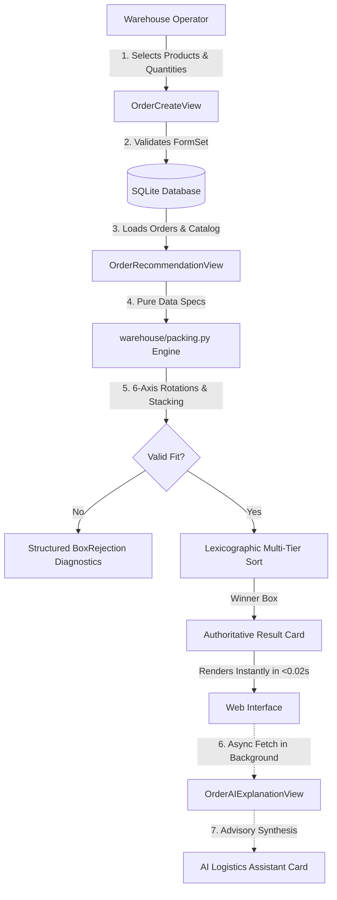

<div align="center">

# 📦 AI-Assisted Box Selection System
### Deterministic Packaging & Warehouse Fulfillment Engine

[](https://www.djangoproject.com/)
[](https://www.python.org/)
[](TEST_OUTPUT.md)
[](warehouse/packing.py)
[](LICENSE)

<p align="center">
  <strong>A high-reliability Django web application for ecommerce warehouse operations.</strong><br>
  Recommends the most suitable, cost-effective shipping box using 6-axis orthogonal rotations, 1D bounding stacks, hard weight capacity gating, and transparent rejection diagnostics.
</p>

[Quickstart](#-quickstart--installation) • [Algorithm Details](#-deterministic-selection-algorithm) • [Architecture](#-system-architecture) • [AI Integration](#-ai-assisted-logistics-layer) • [Test Verification](#-automated-tests--verification)

</div>

---

## 🎯 Problem Statement & Overview

When an ecommerce customer places an order, warehouse staff need to know which shipping box should be used. Using the wrong box results in:
1. **Excess Dimensional Weight & Freight Costs**: Paying for shipping empty air.
2. **Excessive Void Fill Material**: Increased packing labor and packaging waste.
3. **Damaged Goods**: Exceeding box payload capacity or improper spatial orientation.

This system provides an **instant, deterministic fulfillment tool** where warehouse operators input customer order items and receive the exact mathematically optimal shipping box in $<0.02\text{s}$, complete with transparent physical explanations and itemized rejection reasons for disqualified boxes.

---

## 🚀 Key Features

| Feature | Description |
|---|---|
| **100% Deterministic Engine** | Pure Python mathematical calculations. Zero random heuristics, zero third-party bin-packing black boxes. |
| **6-Axis Orthogonal Rotation** | Evaluates all 3D spatial permutations $\mathcal{O}(L, W, H)$ with automatic symmetry deduplication for cubes & square faces. |
| **1D Orthogonal Stacking** | Supports multi-quantity & multi-SKU orders via composite bounding stack alignments. |
| **Payload Capacity Gating** | Hard gate rejecting any candidate box where $\sum (\text{weight} \times \text{quantity}) > \text{box.max\_weight}$. |
| **Deterministic Ranking** | 4-tier lexicographic sort: **Usable Volume $\uparrow$** $\to$ **Unit Cost $\uparrow$** $\to$ **Box Name $\uparrow$** $\to$ **Box ID $\uparrow$**. |
| **Explainable Diagnostics** | Comprehensive breakdown explaining why the winner was chosen and itemizing why alternatives failed (`DIMENSIONS`, `WEIGHT`). |
| **Non-Blocking AI Assistant** | Async advisory layer providing warehouse handling guidance with live token usage and model stats without blocking page load. |
| **Custom Themed Admin Portal** | Unified high-contrast slate theme across both operational order builder and Django Admin. |
| **49 Automated Tests** | Exhaustive unit & integration test coverage across models, forms, geometric rotations, tie-breakers, views, and AI fault tolerance. |

---

## 📐 System Architecture

The project follows clean, idiomatic Django design patterns with an isolated pure domain layer:



---

## 📂 Repository Structure

```text
assignment/
├── .github/
│   └── workflows/
│       └── tests.yml             # GitHub Actions CI automation pipeline
├── config/
│   ├── settings.py               # Django configuration & security defaults
│   ├── urls.py                   # Root URL routing
│   └── wsgi.py
├── warehouse/
│   ├── models.py                 # Product, ShippingBox, Order, OrderItem models
│   ├── packing.py                # Pure domain recommendation & 6-axis rotation engine
│   ├── ai.py                     # Non-blocking AI logistics assistant client
│   ├── forms.py                  # OrderForm & OrderItemFormSet with boundary validation
│   ├── views.py                  # OrderCreateView, RecommendationView, AIExplanationView
│   ├── admin.py                  # Django Admin customizations & inlines
│   ├── urls.py                   # Warehouse app routing
│   ├── fixtures/
│   │   └── sample_warehouse_data.json  # Seed catalog fixture
│   ├── templates/warehouse/
│   │   ├── base.html             # High-contrast accessible layout
│   │   ├── order_form.html       # Interactive order builder
│   │   ├── recommendation_result.html # Winner card, stepper loader & rejection diagnostics
│   │   ├── product_list.html     # Product catalog table
│   │   └── box_list.html         # Box inventory table
│   ├── static/warehouse/
│   │   ├── style.css             # High-contrast warehouse CSS & stepper styles
│   │   └── admin_custom.css      # Custom Django Admin theme
│   └── tests/
│       ├── test_models.py        # Model validation & properties tests (9 tests)
│       ├── test_packing.py       # Rotation, ranking & tie-breaker tests (17 tests)
│       ├── test_forms.py         # FormSet & boundary validation tests (4 tests)
│       ├── test_views.py         # HTTP flow & integration tests (9 tests)
│       ├── test_ai.py            # AI fault-tolerance & resilience tests (7 tests)
│       └── test_admin.py         # Admin branding & registration tests (3 tests)
├── templates/
│   └── admin/
│       └── base_site.html        # Custom Django Admin template override
├── manage.py
├── pytest.ini
├── requirements.txt
├── README.md
├── AI_USAGE.md
└── TEST_OUTPUT.md
```

---

## 🧮 Deterministic Selection Algorithm

The core domain logic in [`warehouse/packing.py`](warehouse/packing.py) executes a 100% deterministic 6-step mathematical pipeline:

```
[Customer Order] 
       │
       ▼
1. Validate Inputs (Quantities >= 1, Dimensions > 0, Weight > 0)
       │
       ▼
2. Calculate Total Weight: W_total = Σ (item.weight × quantity)
       │
       ▼
3. Weight Capacity Gating: Disqualify boxes where W_total > Box.max_weight
       │
       ▼
4. Spatial Orientation & Bounding Stacking:
   ├─ Single Item (Q=1): Test all 6 permutations in O(L, W, H)
   ├─ Single Item (Q>1): Test 1D orthogonal stacks (Q·L, W, H), (L, Q·W, H), (L, W, Q·H)
   └─ Multi-Product: Test composite bounding alignments
       │
       ▼
5. Filter Disqualified Boxes (Capture exact DIMENSIONS or WEIGHT rejection reasons)
       │
       ▼
6. Lexicographic Ranking:
   Sort Valid Boxes by:
   (1) Usable Volume (cm³) [ASC]  → Smallest box preferred
   (2) Unit Cost ($) [ASC]        → Lower cost tie-breaker
   (3) Box Name [ASC]             → Alphabetical tie-breaker
   (4) Box ID [ASC]               → Stable database tie-breaker
```

> [!NOTE]
> The domain module uses frozen dataclasses (`ItemSpec`, `BoxSpec`, `BoxEvaluation`, `RecommendationResult`) and standard Decimal precision throughout, enabling instant in-memory unit testing with zero database overhead.

---

## 🤖 AI-Assisted Logistics Layer

### Strict Non-Negotiable Boundary
The system integrates an optional LLM explanation layer via an OpenAI-compatible API (`https://router.bynara.id/v1`) using model `agnes-2.5-flash` with multi-model fallback (`ox-alpha`).

> [!IMPORTANT]
> **What the AI MUST NOT do:**
> - Select shipping boxes or decide physical fit.
> - Override or alter deterministic recommendations.
> - Modify dimensions, weights, or order quantities.
> - Gate the fulfillment workflow (the core engine functions 100% independently when AI is offline).

> [!TIP]
> **What the AI DOES do:**
> - Generates human-friendly packing & handling summaries for warehouse packing staff.
> - Runs **asynchronously** via background JSON fetch so the main recommendation page loads instantaneously ($<0.02\text{s}$).
> - Features an interactive warehouse-themed stepped loader (`Analyzing request` $\to$ `Generating content` $\to$ `Reviewing quality` $\to$ `Finalizing document`).

---

## ⚡ Quickstart & Installation

### Prerequisites
- Python 3.10+ (Tested on Python 3.12 & 3.13)
- Git

### 1. Clone & Set Up Environment

```bash
# Clone the repository
git clone https://github.com/<your-username>/ai-assisted-box-selection.git
cd ai-assisted-box-selection

# Create virtual environment
python -m venv .venv

# Activate virtual environment
# Windows PowerShell:
.\.venv\Scripts\Activate.ps1
# Linux / macOS:
source .venv/bin/activate

# Install dependencies
pip install -r requirements.txt
```

### 2. Apply Migrations & Load Sample Catalog

```bash
# Apply database schema
python manage.py migrate

# Load standard sample warehouse catalog (Products & Shipping Boxes)
python manage.py loaddata sample_warehouse_data.json
```

### 3. Start Development Server

```bash
python manage.py runserver
```

| Portal | URL | Credentials |
|---|---|---|
| **Warehouse Order Station** | `http://127.0.0.1:8000/` | Open access |
| **Product Catalog** | `http://127.0.0.1:8000/products/` | Open access |
| **Shipping Box Inventory** | `http://127.0.0.1:8000/boxes/` | Open access |
| **Django Admin Portal** | `http://127.0.0.1:8000/admin/` | `admin` / `admin123` |

*(To create a new admin superuser: `python manage.py createsuperuser`)*

---

## 🧪 Automated Tests & Verification

Run the test suite using Django's test runner or Pytest:

```bash
# Run with Django test runner
python manage.py test -v 2

# Or run with Pytest
pytest
```

### Test Suite Summary (49/49 Passing)
```text
warehouse/tests/test_admin.py ...                                        [ 3 passed]
warehouse/tests/test_ai.py .......                                       [ 7 passed]
warehouse/tests/test_forms.py ....                                       [ 4 passed]
warehouse/tests/test_models.py .........                                 [ 9 passed]
warehouse/tests/test_packing.py .................                        [17 passed]
warehouse/tests/test_views.py .........                                  [ 9 passed]

============================= 49 passed in 5.40s ==============================
```

Detailed test logs and environment specifications are recorded in [TEST_OUTPUT.md](TEST_OUTPUT.md).

---

## ⚖️ Design Decisions & Trade-Offs

1. **Deterministic 1D Bounding Stacks vs. 3D Bin Packing Libraries**:
   - *Decision*: Avoided third-party heuristics. General 3D bin packing is NP-hard and introduces probabilistic variance.
   - *Result*: 100% reproducible, explainable, $O(1)$ calculations that can be audited by warehouse supervisors.
2. **Server-Side Rendered Templates with Minimal Vanilla JS**:
   - *Decision*: Avoided heavy frontend frameworks (React/Vue/Tailwind).
   - *Result*: Zero client build steps, instant load times, high-contrast readability on warehouse barcode scanners and rugged terminal tablets.
3. **Decoupled Pure Python Domain Engine**:
   - *Decision*: Isolated `warehouse/packing.py` from Django ORM dependencies.
   - *Result*: Algorithmic unit tests run in $<0.05\text{s}$ without database setup overhead.

---

## 📄 License & Integrity

This project is built under standard software engineering best practices prioritizing correctness over cleverness. For details on AI usage and transparency, see [AI_USAGE.md](AI_USAGE.md).
